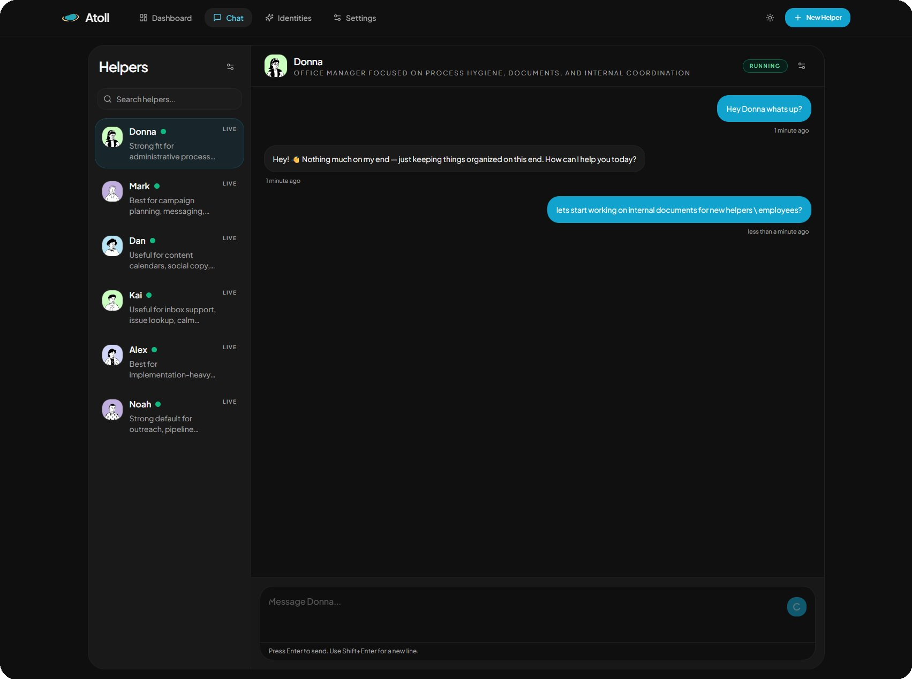
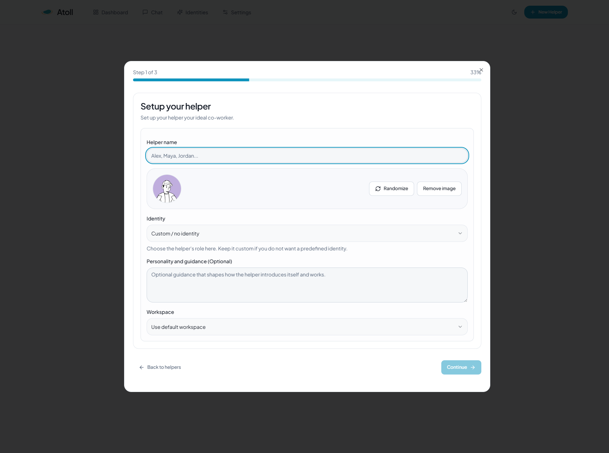
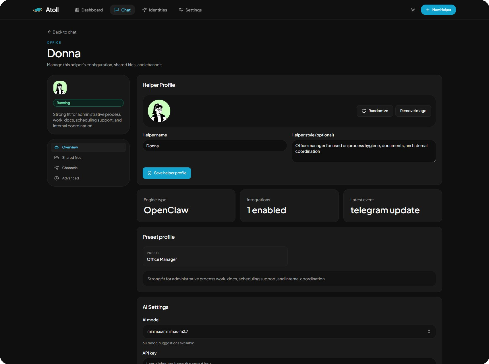
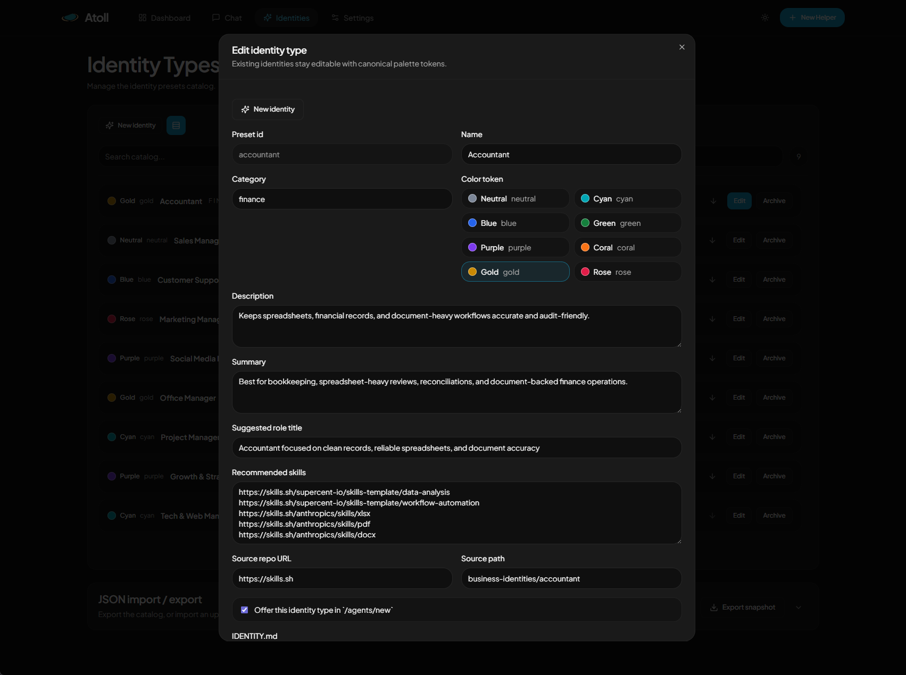

# Atoll OS

<div align="center">


### Turn blank agents into ready-to-work helpers.

[Landing page](https://zivhm.github.io/Atoll-OS/) · [Quick start](#-quick-start) · [Docker Compose](#-docker-compose) · [Core concepts](#-core-concepts) · [Configuration](#%EF%B8%8F-configuration)

[](https://zivhm.github.io/Atoll-OS/)
[](https://github.com/zivhm/Atoll-OS/actions/workflows/deploy-pages.yml)
[](LICENSE)


</div>

---

## 🏝️ Why Atoll

Most agent tools hand you a blank slate and expect you to figure out the rest.
For a freelancer or non-tech owner, that's a dead end. Most just don't have the time or the context to build from zero.

Atoll ships helpers that already know their job.
Pick a role (accountant, support agent, social media manager, or define your own) and the helper comes pre-loaded with the right identity, goals, and behavior.

The underlying runtime is unchanged. We just give it a purpose before you ever open it.

**Atoll focuses on the operating layer around the agent.**

- 🤖 Create helpers with reusable identities, role definitions, and skill/tool context
- 📁 Share files directly with helpers
- 🐳 Provision containered runtimes without hand-wiring every instance
- 🔗 Place helpers in shared or dedicated workspaces
- 💬 Configure Telegram and Discord channels from the same UI
- 🛠 Operate helpers from the browser: chat, logs, health, repair, reconcile, event history
- 🛡 Helpers runs in their own isolated Docker containers with dedicated volumes and networks

---

## At A Glance

| Capability | Description |
| --- | --- |
| **Quick helper setup** | Spin up a helper, assign a workspace, and provision a runtime in minutes |
| **Identity catalog** | Manage reusable business identities and helper presets from the UI |
| **Runtime operations** | Inspect health, logs, events, repair actions, and reconcile flows |
| **Channel wiring** | Expose shared messaging settings in the UI and runtime-native advanced settings where semantics differ |
| **Single-host** | Run locally during development or in Docker Compose for a self-hosted deployment |

---


## App Preview



<table>
  <tr>
    <td></td>
    <td></td>
    <td></td>
  </tr>
</table>

---

## 🚀 Quick Start

### Prerequisites

- Node.js `20+` and `npm`
- Docker Desktop or another reachable Docker engine

### Steps

**1. Copy the example environment file**

```bash
cp .env.example .env
```

**2. Set required variables in `.env`**

```env
ATOLL_SECRETS_KEY=<long-random-string>         # required
ATOLL_LLM_PROVIDER_API_KEY=<your-api-key>      # optional to set default
```

**3. Install dependencies**

```bash
npm install
```

**4. Start the API and app together**

```bash
npm run dev
```

**5. Open in your browser**

Open [http://127.0.0.1:8450](http://127.0.0.1:8450)

---

## 🐳 Docker Compose

For a containerized single-host deployment:

```bash
cp .env.example .env          # set ATOLL_SECRETS_KEY inside
docker compose up --build
```

Open [http://127.0.0.1:8450](http://127.0.0.1:8450)

---

## 🧩 Core Concepts

### Workspaces
Atoll uses tenants as workspaces.

| Type | Description |
| --- | --- |
| `default` | Individual helper workspace for quick setup |
| `dedicated` | Shared workspace with reusable network and storage context |

### Helpers
A helper is the user-facing agent record: name, avatar, role title, preset, skills, and channel settings.

### Runtimes
A runtime is the managed execution environment attached to a helper. Atoll provisions it through Docker, tracks its status, and exposes lifecycle actions through the API and UI.

### Identities
Reusable identity presets live under [`src/business-identities`](src/business-identities) and are editable in the `/identities` screen. These presets seed helper identity, soul, and tools documents.

---

## 🏗 Architecture

```
┌─────────────────────────────────────────────┐
│                  Web UI                     │
│                                             │
└────────────────────┬────────────────────────┘
                     │ /api
┌────────────────────▼────────────────────────┐
│                 API Layer                   │
│                                             │
└──────┬──────────────────────────────────────┘
       │
┌──────▼──────┐     ┌──────────────────────┐
│ Persistence │     │   Runtime Host       │
└─────────────┘     │   Docker engine      │
                    └──────────────────────┘
```

---

## ⚙️ Configuration

All important configuration lives in the repo-root `.env`.

| Variable | Required | Purpose |
| --- | :---: | --- |
| `ATOLL_SECRETS_KEY` | ✅ | Encryption key for stored secrets and sensitive runtime config |
| `ATOLL_LLM_PROVIDER_API_KEY` | | Default provider API key when a helper has none |
| `PORT` | | API port (default `8450`) |
| `HOST` | | API bind host |
| `RUNTIME_PROVIDER` | | Default LLM provider for new helpers |
| `RUNTIME_MODEL` | | Default LLM model for new helpers |
| `RUNTIME_HTTP_TIMEOUT_MS` | | Runtime HTTP timeout in ms (default `3600000`) |
| `RUNTIME_OPENCLAW_IMAGE` | ✅ | OpenClaw runtime image |
| `RUNTIME_ZEROCLAW_IMAGE` | ✅ | ZeroClaw runtime image |
| `RUNTIME_HERMES_IMAGE` | ✅ | Hermes runtime image |
| `RUNTIME_GUI_SIDECAR_IMAGE` | ✅ | GUI sidecar runtime image (required when gui.enabled is used) |
| `RUNTIME_STARTUP_VALIDATION` | | Prerequisite validation: `strict`, `warn`, or `off` |
| `RUNTIME_ALLOW_PUBLIC_BIND` | | Whether helper gateways bind to host loopback by default |
| `RUNTIME_REQUIRE_PAIRING` | | Whether pairing is required for supported runtimes |
| `ATOLL_CORS_ALLOWED_ORIGINS` | | Needed when the web app is on a different origin than the API |

> The Settings screen writes managed runtime defaults back to `.env`. Changes require an API restart to fully apply.

Runtime image sources:
- `RUNTIME_OPENCLAW_IMAGE`: published image (default in `.env.example`: `zivhm/openclaw`).
- `RUNTIME_ZEROCLAW_IMAGE`: published image (default in `.env.example`: `zivhm/zeroclaw-runtime`).
- `RUNTIME_HERMES_IMAGE`: published image (default in `.env.example`: `nousresearch/hermes-agent`).
- `RUNTIME_GUI_SIDECAR_IMAGE`: local image built from [`docker/runtime-gui-sidecar/Dockerfile`](docker/runtime-gui-sidecar/Dockerfile) (default tag in `.env.example`: `atoll-gui-sidecar`).

GUI sidecar runtime options (available on all runtime types):
- `gui.enabled`: create and reconcile a GUI sidecar for the runtime container.
- `gui.enableVnc`: enable `x11vnc` + `noVNC` inside the sidecar.
- `gui.noVncPort`: optional host loopback port mapped to sidecar `6080` when VNC is enabled.

Runtime container environment contract for GUI automation:
- `ATOLL_GUI_PLAYWRIGHT_WS_ENDPOINT`: deterministic Playwright endpoint (example: `ws://atoll-gui-<runtime>:3000/playwright`).
- `ATOLL_GUI_SIDECAR_CONTAINER`: resolved sidecar container name on the runtime network.

---

## 📡 API Surface

| Route group | Purpose |
| --- | --- |
| `/api/healthz` | Health check |
| `/api/auth/me` | Auth context |
| `/api/settings/config` | Runtime defaults |
| `/api/tenants` | Workspace management |
| `/api/agents` | Helper CRUD |
| `/api/agent-presets` | Preset catalog |
| `/api/runtime/catalog` | Available runtime types |
| `/api/runtime/provision-jobs` | Provision job tracking |
| `/api/runtime/instances/*` | Lifecycle, chat, diagnostics |
| `/api/runtime/events` | Event history |
| `/api/runtime/model-catalog` | LLM model listing |

---

## 📁 Project Structure

```
src/                      Fastify API, runtime orchestration, storage, identity presets
src/http/routes/          API route modules
src/business-identities/  Reusable helper identity presets
web/                      React/Vite control-plane frontend
landing/                  GitHub Pages landing site
scripts/                  Development helpers
tests/                    API/runtime-focused tests
Dockerfile                Production image build
docker-compose.yml        Single-host deployment
atoll-state.json          Local persisted state file
```

---

## Runtime Notes

| Setting | Value |
| --- | --- |
| Supported runtimes | OpenClaw, ZeroClaw, Hermes |
| Default runtime type | `openclaw` |
| Default hosted provider | `openrouter` |
| Default hosted model | `anthropic/claude-sonnet-4.6` |
| Long-term direction | Harness/Provider-agnostic runtime support |

### Runtime Support Matrix

| Runtime | Status | Chat transport | Messaging surface |
| --- | --- | --- | --- |
| OpenClaw | Supported | Native OpenClaw gateway websocket | Shared Telegram, Slack, Discord controls |
| ZeroClaw | Supported | HTTP webhook/message bridge | Shared Telegram controls, pairing/webhook flows |
| Hermes | Beta | OpenAI-compatible API server (`/v1/chat/completions`) | Shared Telegram/Slack overlap plus Hermes-native advanced runtime config |

### Hermes Notes

- Hermes containers are managed directly by Atoll through the same runtime connector flow as other runtimes.
- Hermes uses its native `/opt/data` layout with `config.yaml` and `.env`, not the OpenClaw filesystem contract.
- Hermes-specific messaging controls that do not map cleanly to the shared UI are exposed through advanced runtime config instead of the generic integration cards.
- Remaining Hermes risk is live provider QA with real Telegram, Slack, and Discord credentials. Local Docker provisioning, health, auth, model discovery, chat, and config seeding are verified.

---

## 🌐 Landing Page

The public site is hosted on GitHub Pages, separate from the self-hosted control-plane app.

- **Site:** [https://zivhm.github.io/Atoll-OS/](https://zivhm.github.io/Atoll-OS/)
- **Source:** [`landing/`](landing/)

---

## License

See [`LICENSE`](LICENSE).
