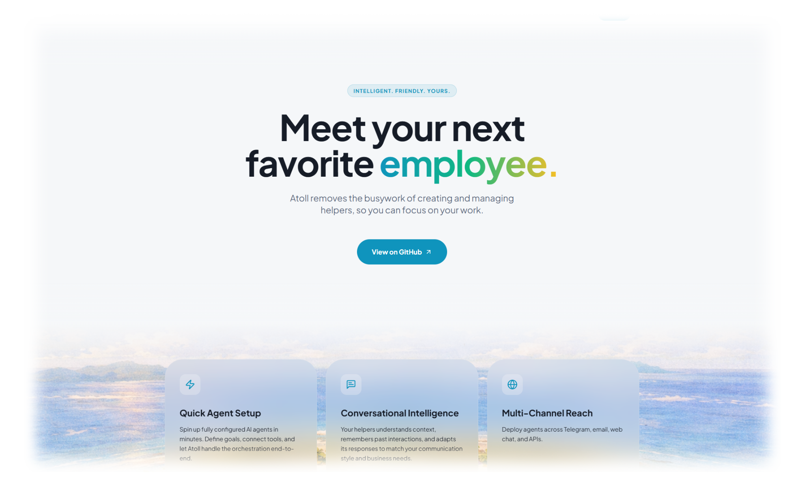

# Atoll OS

<div align="center">

[](https://zivhm.github.io/Atoll-OS/)
[](https://github.com/zivhm/Atoll-OS/actions/workflows/deploy-pages.yml)
[](LICENSE)


**Meet your next favorite employee.**

Atoll removes the busywork of creating and managing AI helpers, so you can focus on your work.

[Landing page](https://zivhm.github.io/Atoll-OS/) · [Quick start](#-quick-start) · [Docker Compose](#-docker-compose) · [Core concepts](#-core-concepts) · [Configuration](#%EF%B8%8F-configuration)



</div>

---

## 🖼 App Preview

| Helper setup | Runtime operations |
| :---: | :---: |
| `Placeholder` | `Placeholder` |

| Identity catalog | Channel configuration |
| :---: | :---: |
| `Placeholder` | `Placeholder` |

---

## Why Atoll

Most agent projects focus on the helper itself. **Atoll focuses on the operating layer around it.**

- 🗂 Create helpers with reusable identities, role definitions, and skill/tool context
- 🐳 Provision Docker-backed runtimes without hand-wiring every instance
- 🔗 Place helpers in shared or dedicated workspaces
- 💬 Configure Telegram and Discord channels from the same UI
- 🛠 Operate helpers from the browser — chat, logs, health, repair, reconcile, event history
- 🔒 Keep local state simple while protecting sensitive credentials behind an app-level secrets key

---

## At A Glance

| Capability | Description |
| --- | --- |
| **Quick helper setup** | Spin up a helper, assign a workspace, and provision a runtime in minutes |
| **Identity catalog** | Manage reusable business identities and helper presets from the UI |
| **Runtime operations** | Inspect health, logs, events, repair actions, and reconcile flows |
| **Channel wiring** | Expose Telegram and Discord settings without spreading config across tools |
| **Single-host friendly** | Run locally during development or in Docker Compose for a self-hosted deployment |

> **Optimized for today:** local and single-host operation, Docker-managed runtimes, OpenClaw-backed execution — with a long-term direction toward harness-agnostic runtime support.

---

## 🚀 Quick Start

### Prerequisites

- Node.js `20+` and `npm`
- Docker Desktop or another reachable Docker engine

> The UI can boot without Docker, but provisioning and runtime lifecycle actions require a reachable Docker engine.

### Steps

**1. Copy the example environment file**

```bash
cp .env.example .env
```

**2. Set required variables in `.env`**

```env
ATOLL_SECRETS_KEY=<long-random-string>         # required
ATOLL_LLM_PROVIDER_API_KEY=<your-api-key>      # optional default
```

**3. Install dependencies**

```bash
npm install
```

**4. Start the API and app together**

```bash
npm run dev
```

**5. Open in your browser**

| Service | URL |
| --- | --- |
| App UI | http://127.0.0.1:8080 |
| API | http://127.0.0.1:8450 |

> `npm run dev` pins the API to `PORT` or `8450` by default and configures Vite to proxy `/api` requests to that origin.

---

## 🐳 Docker Compose

For a containerized single-host deployment:

```bash
cp .env.example .env          # set ATOLL_SECRETS_KEY inside
docker compose up --build
```

Open [http://127.0.0.1:8450](http://127.0.0.1:8450)

> In Docker mode, the built frontend is served by the API container on the same port. Compose stores runtime data in the `atoll_data` volume and mounts the Docker socket so Atoll can manage helper runtimes.

---

## 🧩 Core Concepts

### Workspaces
Atoll uses tenants as workspaces.

| Type | Description |
| --- | --- |
| `default` | Individual helper workspace for quick setup |
| `dedicated` | Shared workspace with reusable network and storage context |

### Helpers
A helper is the user-facing agent record: name, avatar, role title, preset, skills, and channel settings.

### Runtimes
A runtime is the managed execution environment attached to a helper. Atoll provisions it through Docker, tracks its status, and exposes lifecycle actions through the API and UI.

### Identities
Reusable identity presets live under [`src/business-identities`](src/business-identities) and are editable in the `/identities` screen. These presets seed helper identity, soul, and tools documents.

---

## 🏗 Architecture

```
┌─────────────────────────────────────────────┐
│                  Web UI                     │
│         React 18 + Vite + Tailwind          │
└────────────────────┬────────────────────────┘
                     │ /api
┌────────────────────▼────────────────────────┐
│                 API Layer                   │
│           Fastify + TypeScript              │
└──────┬──────────────────────────────────────┘
       │
┌──────▼──────┐     ┌──────────────────────┐
│  Persistence │     │   Runtime Host       │
│  JSON + enc. │     │   Docker engine      │
└─────────────┘     └──────────────────────┘
```

---

## ⚙️ Configuration

All day-to-day configuration lives in the repo-root `.env`.

| Variable | Required | Purpose |
| --- | :---: | --- |
| `ATOLL_SECRETS_KEY` | ✅ | Encryption key for stored secrets and sensitive runtime config |
| `ATOLL_LLM_PROVIDER_API_KEY` | — | Default provider API key when a helper has none |
| `PORT` | — | API port (default `8450`) |
| `HOST` | — | API bind host |
| `RUNTIME_PROVIDER` | — | Default LLM provider for new helpers |
| `RUNTIME_MODEL` | — | Default LLM model for new helpers |
| `RUNTIME_HTTP_TIMEOUT_MS` | — | Runtime HTTP timeout in ms (default `3600000`) |
| `RUNTIME_OPENCLAW_IMAGE` | — | OpenClaw runtime image override |
| `RUNTIME_STARTUP_VALIDATION` | — | Prerequisite validation: `strict`, `warn`, or `off` |
| `RUNTIME_ALLOW_PUBLIC_BIND` | — | Whether helper gateways bind to host loopback by default |
| `RUNTIME_REQUIRE_PAIRING` | — | Whether pairing is required for supported runtimes |
| `ATOLL_CORS_ALLOWED_ORIGINS` | — | Needed when the web app is on a different origin than the API |

> The Settings screen writes managed runtime defaults back to `.env`. Changes require an API restart to fully apply.

---

## 📡 API Surface

| Route group | Purpose |
| --- | --- |
| `/api/healthz` | Health check |
| `/api/auth/me` | Auth context |
| `/api/settings/config` | Runtime defaults |
| `/api/tenants` | Workspace management |
| `/api/agents` | Helper CRUD |
| `/api/agent-presets` | Preset catalog |
| `/api/runtime/catalog` | Available runtime types |
| `/api/runtime/provision-jobs` | Provision job tracking |
| `/api/runtime/instances/*` | Lifecycle, chat, diagnostics |
| `/api/runtime/events` | Event history |
| `/api/runtime/model-catalog` | LLM model listing |

---

## 📁 Project Structure

```
src/                      Fastify API, runtime orchestration, storage, identity presets
src/http/routes/          API route modules
src/business-identities/  Reusable helper identity presets
web/                      React/Vite control-plane frontend
landing/                  GitHub Pages landing site
scripts/                  Development helpers
tests/                    API/runtime-focused tests
Dockerfile                Production image build
docker-compose.yml        Single-host deployment
atoll-state.json          Local persisted state file
```

---

## Runtime Notes

| Setting | Value |
| --- | --- |
| Supported runtime | OpenClaw |
| Default runtime type | `openclaw` |
| Default hosted provider | `openrouter` |
| Default hosted model | `anthropic/claude-sonnet-4.6` |
| Long-term direction | Harness-agnostic runtime support |

> If the frontend build is missing in production mode, non-API browser requests return `503` — run `npm run build` or use `npm run dev`.

---

## 🌐 Landing Page

The public marketing site is hosted on GitHub Pages, separate from the self-hosted control-plane app.

- **Site:** [https://zivhm.github.io/Atoll-OS/](https://zivhm.github.io/Atoll-OS/)
- **Source:** [`landing/`](landing/)

---

## License

See [`LICENSE`](LICENSE).
